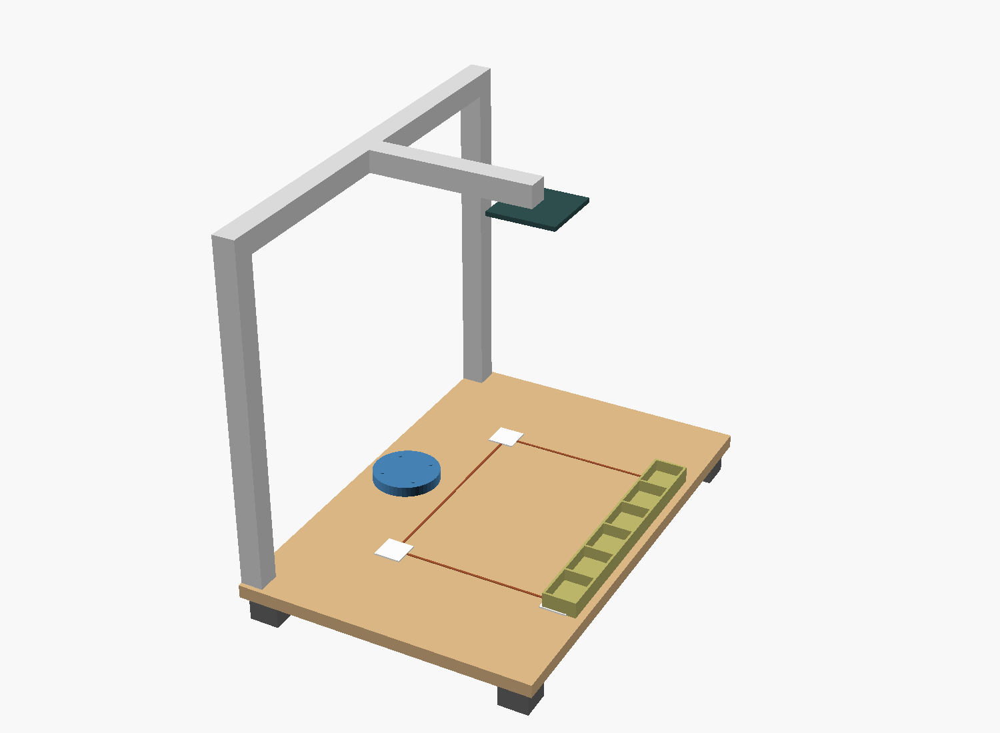

# TACTIN — vibe hardware for the engineer's workbench

> Software gets `⌘+Enter` → prototype in 20 seconds. Hardware still gets
> tweezers, a magnifier, and a steady hand. **TACTIN closes that gap.**

TACTIN is an AI agent that drives a desktop robot arm to assemble electronic
components on a hardware engineer's prototyping bench. You drop parts on the
bench and describe the build in plain language; an overhead camera localizes
the parts, an LLM (Claude) plans the pick-and-place sequence, and a 5-DOF arm
with a vacuum nozzle does the work — while you do something else.

It is **physical AI for the lab bench**: the gap between "vibe coding" and
"vibe *hardware*", aimed at hardware developers and prototyping labs (B2B), not
the factory floor. Factories already have 5-figure robots doing the same thing
a million times; nobody automates the *one-off* bench build that an engineer
repeats fifty times a day. That is the TACTIN slot.



---

## How it fits together

```
  natural language                overhead camera (RGB)
        │                                │
        ▼                                ▼
  ┌───────────────┐   tool calls   ┌──────────────┐   pixels→mm   ┌──────────┐
  │  Claude agent │ ─────────────▶ │  TACTIN core │ ◀──────────── │  vision  │
  │ (tool-use loop)│ ◀──────────── │ safety + IK  │   homography  │ calibrate│
  └───────────────┘   tool results └──────┬───────┘               └──────────┘
                                          │ joint angles
                                          ▼
                                   ┌──────────────┐   USB serial   ┌──────────┐
                                   │ ArmController │ ─────────────▶ │  ESP32   │
                                   │ pick / place  │                │ + servos │
                                   └──────────────┘                │ + vacuum │
                                                                    └──────────┘
```

| Layer | Module | What it does |
|-------|--------|--------------|
| Agent | `tactin/agent/` | Claude tool-use loop; the bench image + state in, pick/place tool calls out |
| World model | `tactin/workspace.py` | What's on the bench, what's held, where things go |
| Kinematics | `tactin/kinematics.py` | Closed-form 5-DOF forward/inverse kinematics |
| Safety | `tactin/safety.py` | Every target gated against the work envelope + joint limits |
| Control | `tactin/arm/` | Linear motion planning, pick/place primitives, drivers |
| Vision | `tactin/vision/` | Overhead camera + ArUco homography (pixels → bench mm) |
| Firmware | `firmware/` | ESP32 servo-bus + vacuum controller |
| Hardware | `hardware/` | Parametric OpenSCAD workbench + render |

The **core is pure Python with zero dependencies** and runs anywhere. Hardware
(`pyserial`), vision (`opencv`), and the agent (`anthropic`) are optional
extras, imported lazily — with none installed, everything runs in simulation.

---

## Quick start

```bash
pip install -e .              # core only, no dependencies
python -m tactin.cli info     # arm spec + work area
python -m tactin.cli selftest # kinematics round-trip across the workspace
python -m tactin.cli demo     # scripted pick-and-place on a sample bench (offline)
```

Run the LLM agent (needs an API key — drives the simulation arm by default):

```bash
pip install -e ".[agent]"
export ANTHROPIC_API_KEY=...
python -m tactin.cli run "put the LED and the 330Ω resistor on the breadboard"
```

Drive a real arm by swapping the driver for `SerialDriver` and flashing
`firmware/tactin_arm_esp32`. See [`hardware/README.md`](hardware/README.md).

---

## Tests

```bash
pip install -e ".[dev]"
pytest -q          # kinematics round-trip, safety, world model, agent loop
```

The agent loop is tested end-to-end with a scripted fake client, so the
pick → place → finish behaviour is verified with no network and no hardware.

---

## What it is / isn't

- **Is:** an engineer's-bench pick-and-place copilot — one-off prototype
  assembly, test-jig population, tray-to-board placement, driven by language.
- **Isn't:** a soldering robot, a high-volume SMT line, or a factory cell.
  It places parts; you still bring the iron (for now).

## License

Proprietary. All rights reserved.
